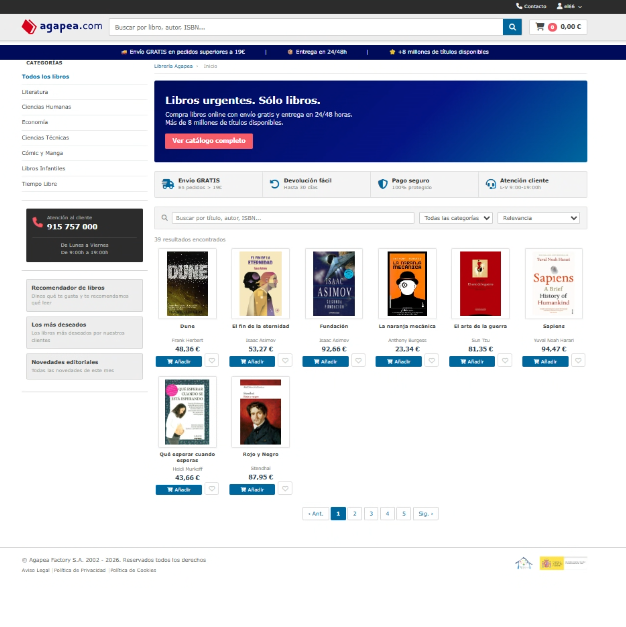
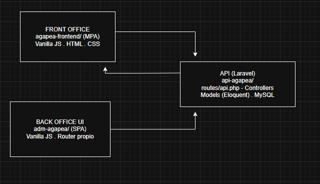
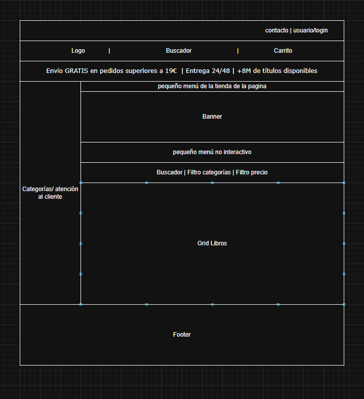
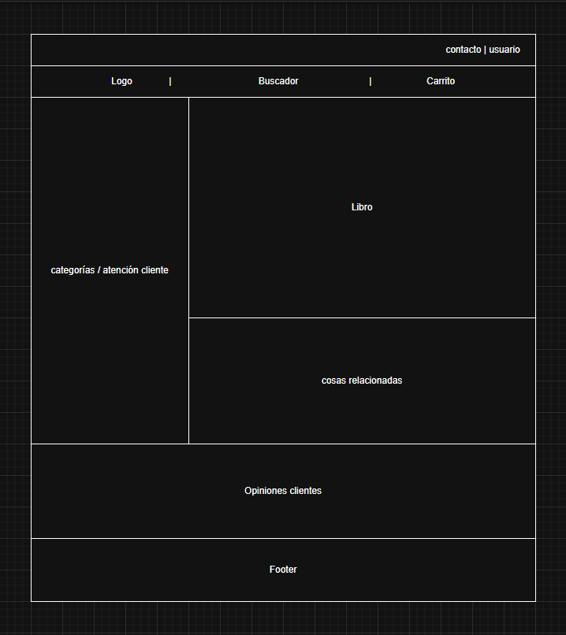
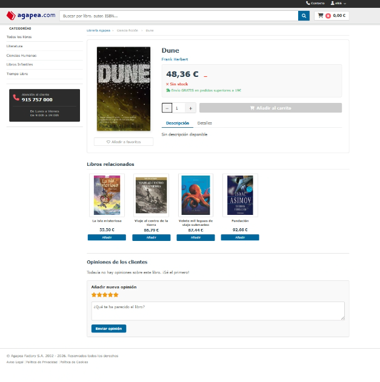
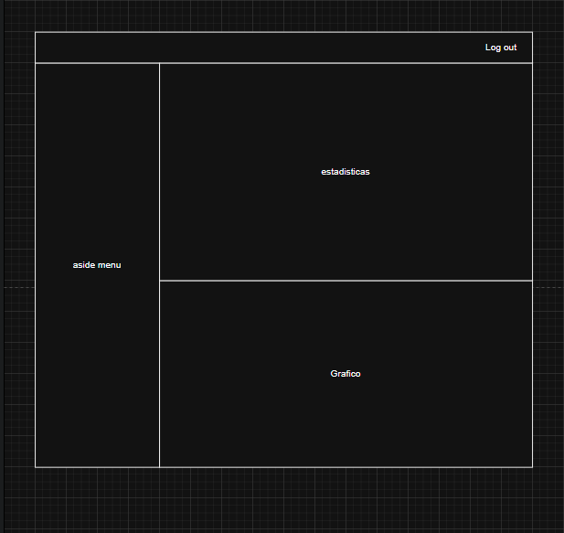
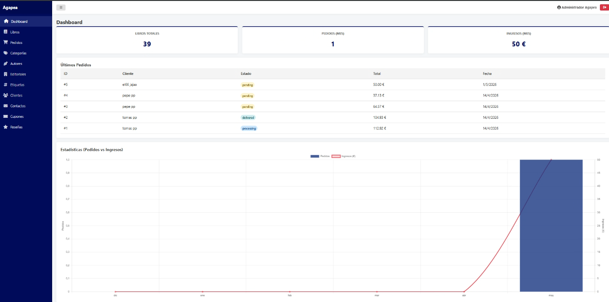
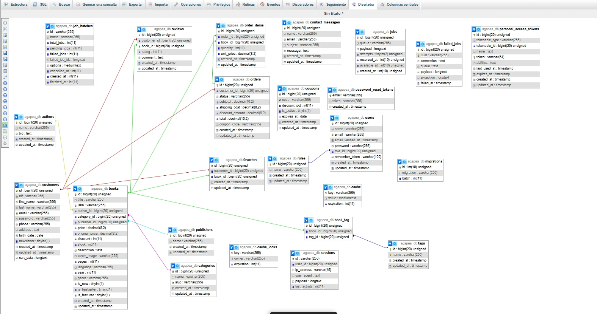
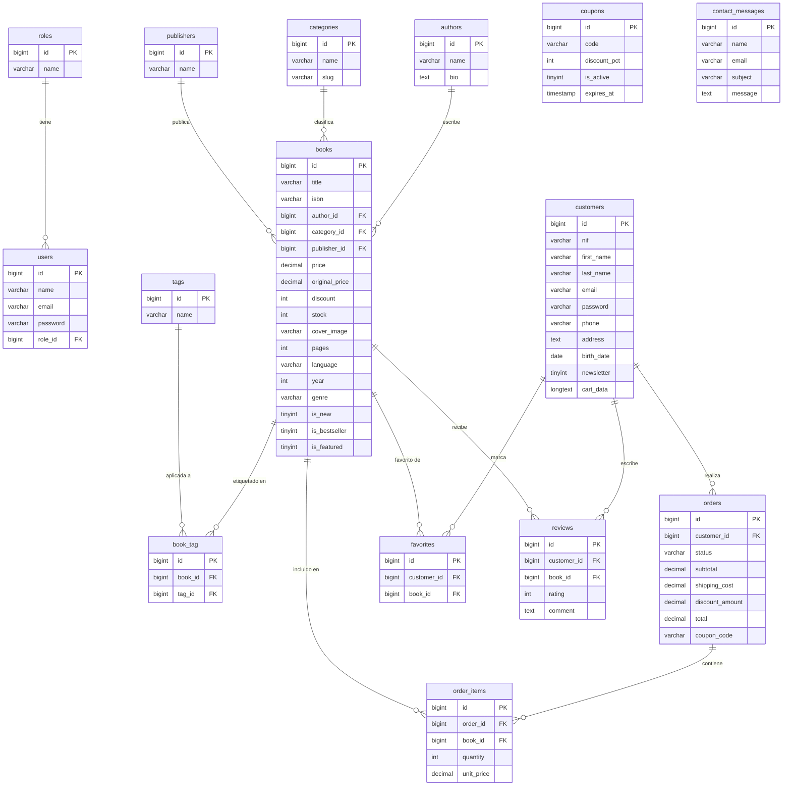

# Documentación Técnica — Clon de Agapea

---

## PORTADA

| Campo | Detalle |
|---|---|
| **Nombre del Proyecto** | Clon de Agapea — Plataforma de Venta de Libros Online |
| **Tipo de Aplicación** | MPA (Storefront público) + SPA (Panel de Administración) |
| **Tecnologías Principales** | PHP 8 / Laravel · Vanilla JS ES6+ · MySQL/MariaDB |
| **Arquitectura** | Headless · API REST · MVC |
| **Equipo de Desarrollo** | Richard · Tomás |
| **Idioma de la Documentación** | Castellano |

<div align="center">
  
</div>

---

## ÍNDICE

1. [Descripción del Proyecto](#1-descripción-del-proyecto)
    - [1.1 Motivación](#11-motivación)
    - [1.2 Objetivo Principal](#12-objetivo-principal)
    - [1.3 Necesidades que Cubre](#13-necesidades-que-cubre)
    - [1.4 Tipo de Usuarios](#14-tipo-de-usuarios)
2. [Requisitos Funcionales y Técnicos](#2-requisitos-funcionales-y-técnicos)
3. [Arquitectura del Sistema](#3-arquitectura-del-sistema)
    - [3.1 Tipo de Arquitectura](#31-tipo-de-arquitectura)
    - [3.2 Separación Front Office / Back Office](#32-separación-front-office--back-office)
    - [3.3 Stack Tecnológico y Justificación de Elección](#33-stack-tecnológico-y-justificación-de-elección)
    - [3.4 Clasificación Técnica de la Aplicación](#34-clasificación-técnica-de-la-aplicación)
4. [Diseño de la Interfaz](#4-diseño-de-la-interfaz)
    - [4.1 Wireframes y Mockups](#41-wireframes-y-mockups)
    - [4.2 Estructura de Contenidos — Front Office (MPA)](#42-estructura-de-contenidos--front-office-mpa)
    - [4.3 Estructura de Contenidos — Back Office (SPA)](#43-estructura-de-contenidos--back-office-spa)
    - [4.4 Diseño Responsivo](#44-diseño-responsivo)
5. [Base de Datos](#5-base-de-datos)
    - [5.1 Sistema Gestor](#51-sistema-gestor)
    - [5.2 Tablas Identificadas](#52-tablas-identificadas)
    - [5.3 Modelo Relacional — Relaciones Principales](#53-modelo-relacional--relaciones-principales)
    - [5.4 Ejemplo de Modelo Eloquent](#54-ejemplo-de-modelo-eloquent)
    - [5.5 Diagrama Entidad-Relación (Mermaid)](#55-diagrama-entidad-relación-mermaid)
6. [Backend — API REST](#6-backend--api-rest)
    - [6.1 Estructura MVC](#61-estructura-mvc)
    - [6.2 Tabla de Endpoints](#62-tabla-de-endpoints)
    - [6.3 Lógica de Negocio Destacada](#63-lógica-de-negocio-destacada)
7. [Frontend](#7-frontend)
    - [7.1 Organización Modular del Código](#71-organización-modular-del-código)
    - [7.2 Comunicación con la API — fetch con async/await](#72-comunicación-con-la-api--fetch-con-asyncawait)
    - [7.3 Manipulación del DOM](#73-manipulación-del-dom)
    - [7.4 Búsqueda con Debounce (400 ms)](#74-búsqueda-con-debounce-400-ms)
    - [7.5 Filtros Combinados y Paginación Dinámica](#75-filtros-combinados-y-paginación-dinámica)
    - [7.6 Validación de Formularios](#76-validación-de-formularios)
    - [7.7 localStorage — Claves Utilizadas](#77-localstorage--claves-utilizadas)
    - [7.8 Sincronización Híbrida del Carrito](#78-sincronización-híbrida-del-carrito)
    - [7.9 Enrutamiento SPA — Panel de Administración](#79-enrutamiento-spa--panel-de-administración)
8. [Configuración del Entorno](#8-configuración-del-entorno)
    - [8.1 Requisitos del Sistema](#81-requisitos-del-sistema)
    - [8.2 Instalación del Backend](#82-instalación-del-backend-api-agapea)
    - [8.3 Configuración del Frontend](#83-configuración-del-frontend)
    - [8.4 Variables de Entorno Relevantes](#84-variables-de-entorno-relevantes-env)
9. [Proceso de Desarrollo](#9-proceso-de-desarrollo)
    - [a) Análisis de la Web a Clonar](#a-análisis-de-la-web-a-clonar)
    - [b) Diseño de Wireframes](#b-diseño-de-wireframes)
    - [c) Desarrollo del Front Office (MPA)](#c-desarrollo-del-front-office-mpa)
    - [d) Pruebas del Frontend con Datos Temporales](#d-pruebas-del-frontend-con-datos-temporales)
    - [e) Diseño de la Base de Datos](#e-diseño-de-la-base-de-datos)
    - [f) Configuración del Entorno Backend](#f-configuración-del-entorno-backend)
    - [g) Desarrollo del Backend junto a la Base de Datos](#g-desarrollo-del-backend-junto-a-la-base-de-datos)
    - [h) Desarrollo del Back Office (SPA)](#h-desarrollo-del-back-office-spa)
    - [i) Integración Frontend–Backend](#i-integración-frontendbackend)
    - [j) Pruebas de Integración](#j-pruebas-de-integración)
    - [k) Resolución de Errores](#k-resolución-de-errores)
    - [l) Incorporación de Librerías Complementarias](#l-incorporación-de-librerías-complementarias)
10. [Componentes y Vistas](#10-componentes-y-vistas)
    - [10.1 Front Office — Componentes y Funcionalidades](#101-front-office--componentes-y-funcionalidades)
    - [10.2 Back Office — Panel de Administración (SPA)](#102-back-office--panel-de-administración-spa)
11. [Seguridad](#11-seguridad)
    - [11.1 Sistema de Autenticación](#111-sistema-de-autenticación)
    - [11.2 Separación de Roles](#112-separación-de-roles)
    - [11.3 Protección de la API](#113-protección-de-la-api)
12. [Conclusión](#12-conclusión)
    - [12.1 Problemas Encontrados y Soluciones Aplicadas](#121-problemas-encontrados-y-soluciones-aplicadas)
    - [12.2 Aportaciones del Equipo](#122-aportaciones-del-equipo)
    - [12.3 Mejoras Futuras](#123-mejoras-futuras)
    - [12.4 Conclusión Final](#124-conclusión-final)

---

## 1. DESCRIPCIÓN DEL PROYECTO

### 1.1 Motivación

Se ha seleccionado la plataforma **Agapea.com** como referencia de clonado por motivos de naturaleza tanto técnica como estratégica.

En el plano técnico, la web satisface la totalidad de los requerimientos funcionales establecidos en el enunciado del proyecto: catálogo paginado, búsqueda avanzada, carrito de la compra, autenticación de usuarios y panel de administración. En el plano estratégico, el sector de la librería física representa un caso de uso real con impacto social directo: la mayoría de librerías independientes carece de presencia digital competitiva, quedando excluida de un mercado de venta online que concentran principalmente plataformas como Casa del Libro, Fnac y la propia Agapea. Se considera, por tanto, que el dominio de este tipo de desarrollo abre oportunidades laborales directas, tanto en el ámbito de grandes plataformas de comercio electrónico como en el de la consultoría y el desarrollo a medida para librerías locales que buscan digitalizarse.

Adicionalmente, la elección estuvo motivada por la experiencia directa de uno de los integrantes del equipo en el sector librería, lo que permitió aportar una perspectiva real sobre las necesidades operativas del negocio.

### 1.2 Objetivo Principal

El objetivo del proyecto consiste en construir un clon funcional de Agapea.com que satisfaga los requisitos técnicos de la asignatura: implementar una arquitectura desacoplada con frontend independiente del backend, una API REST propia, un modelo de datos relacional completo y una interfaz de usuario funcional tanto para clientes como para administradores.

### 1.3 Necesidades que Cubre

**A nivel de usuario cliente:**

- Consulta del catálogo de libros disponibles.
- Filtrado por nombre, orden alfabético y precio.
- Visualización del detalle de cada libro.
- Gestión del carrito de la compra (añadir, modificar cantidad, eliminar y vaciar).
- Publicación de reseñas sobre libros.
- Envío de mensajes de contacto relacionados con pedidos u otras consultas.
- Registro, inicio y cierre de sesión.
- Marcado de libros como favoritos.

**A nivel de usuario administrador:**

- Gestión completa del catálogo: alta, edición y baja de libros, autores, categorías y etiquetas.
- Visualización de mensajes de clientes.
- Consulta de datos y gráficas de ventas y pedidos.
- Administración de usuarios, roles y cupones de descuento.

### 1.4 Tipo de Usuarios

| Rol | Descripción | Módulo de acceso |
|---|---|---|
| **Visitante** | Usuario anónimo con acceso de solo lectura al catálogo público | `agapea-frontend/` |
| **Cliente (Customer)** | Usuario registrado que gestiona carrito, favoritos, reseñas y pedidos | `agapea-frontend/` |
| **Administrador (User)** | Gestor con acceso al panel de control y operaciones CRUD completas | `adm-agapea/` |

---

## 2. REQUISITOS FUNCIONALES Y TÉCNICOS

La siguiente tabla refleja el estado de implementación de cada requisito evaluable definido en el enunciado del proyecto:

| Requisito | Estado | Descripción de la implementación |
|---|---|---|
| **Validación de formularios** | Implementado | Validación en cliente mediante JS nativo antes de enviar al backend. El backend aplica validación adicional mediante las reglas de Laravel. |
| **Peticiones asíncronas a API propia (JSON)** | Implementado | API RESTful en Laravel (`/api/v1/`) consumida mediante `fetch` con `async/await`. Todas las respuestas se devuelven en formato JSON. |
| **Búsqueda y filtrado de datos JSON** | Implementado | Búsqueda por texto (`?search=`), filtro por categoría (`?category=`) y ordenamiento por precio y alfabético (`?sort=`). Procesado del lado del servidor. |
| **Paginación de elementos** | Implementado | El backend devuelve un objeto `meta` con el total de registros y la página actual; el frontend genera los controles de paginación de forma dinámica. |
| **Persistencia en localStorage** | Implementado | Carrito (`agapea_carrito`), favoritos (`agapea_favs`), token de sesión (`agapea_token`) y datos del usuario (`agapea_usuario`) se persisten en el navegador. |
| **Persistencia en base de datos** | Implementado | Catálogo, usuarios, pedidos y sincronización del carrito se almacenan en MySQL/MariaDB mediante Eloquent ORM. |
| **Front Office (parte pública)** | Implementado | Storefront MPA con catálogo, detalle de libro, carrito, registro, login, favoritos, reseñas y formulario de contacto. |
| **Back Office (panel de administración)** | Implementado | Panel SPA con CRUD completo de libros, categorías, autores, editoriales, etiquetas, clientes, pedidos, cupones y reseñas. |
| **CRUD completo** | Implementado | Todos los recursos del panel de administración disponen de las cuatro operaciones (crear, leer, actualizar, eliminar). |
| **Autenticación por token** | Implementado | Laravel Sanctum genera tokens de acceso personal; el frontend los gestiona mediante `localStorage` y los adjunta en la cabecera `Authorization` de cada petición protegida. |

---

## 3. ARQUITECTURA DEL SISTEMA

### 3.1 Tipo de Arquitectura

Se ha adoptado una **arquitectura Headless (desacoplada)**, en la que el frontend y el backend son proyectos completamente independientes que se comunican exclusivamente mediante peticiones HTTP con respuestas en formato JSON.

El backend sigue el patrón **MVC (Model-View-Controller)** propio de Laravel, donde la capa *View* queda sustituida por la serialización JSON, puesto que la responsabilidad del renderizado recae íntegramente en el cliente.



### 3.2 Separación Front Office / Back Office

| | Front Office (`agapea-frontend/`) | Back Office (`adm-agapea/`) |
|---|---|---|
| **Tipo** | MPA (Multi-Page Application) | SPA (Single-Page Application) |
| **Usuarios** | Clientes y visitantes | Administradores |
| **Renderizado** | Cada archivo HTML es un punto de entrada independiente | Un único `index.html`; el router JS carga los componentes sin recargar la página |
| **Enrutamiento** | Navegación nativa entre archivos `.html` | `Router.js` propio basado en hash o historial del navegador |

### 3.3 Stack Tecnológico y Justificación de Elección

#### Frontend — Tecnologías y justificación

| Tecnología | Rol | Justificación |
|---|---|---|
| **HTML5 + CSS3** | Estructura y estilos | Base estándar del desarrollo web. El uso de CSS propio permite un control total sobre el diseño sin introducir dependencias externas, aunque conlleva una inversión de tiempo mayor que el uso de un framework. |
| **JavaScript Vanilla ES6+ (Modules)** | Lógica de la interfaz y comunicación con la API | Seleccionado como requisito de la asignatura para demostrar el dominio del lenguaje base sin abstracciones de framework. Permite comprender en profundidad `fetch`, la manipulación del DOM, la gestión de eventos y el estado de la aplicación. |
| **FontAwesome** | Iconografía | Biblioteca de iconos vectoriales ampliamente documentada, integrada mediante CDN, que no requiere configuración adicional en el proyecto. |
| **Chart.js** | Visualización de datos en el panel de administración | Librería ligera de integración directa mediante `<script>` que permite renderizar gráficas de ventas y pedidos sin necesidad de un entorno de compilación adicional. |
| **SweetAlert2** | Alertas y confirmaciones de acciones críticas | Reemplaza los diálogos nativos del navegador por modales estilizados, mejorando la experiencia del usuario en operaciones destructivas como la eliminación de registros. |
| **Visual Studio Code** | Editor de código y servidor de desarrollo frontend | Editor principal utilizado durante el desarrollo del front office. La extensión Live Server permitió servir los archivos HTML estáticos en local con recarga automática, sin necesidad de ningún proceso de compilación. |

#### Backend y herramientas — Tecnologías y justificación

| Tecnología | Rol | Justificación |
|---|---|---|
| **Laravel (PHP 8.x)** | Framework del backend | Indicado por el profesorado como tecnología de referencia para el proyecto. Laravel implementa el patrón MVC de forma estricta, ofrece Eloquent ORM para la gestión de la base de datos y Sanctum para la autenticación por tokens, cubriendo todos los requerimientos con una base de código organizada y mantenible. |
| **Laravel Sanctum** | Autenticación por token API | Solución oficial del ecosistema Laravel para APIs stateless. Genera tokens de acceso personal gestionables, adecuados para la autenticación de SPAs y clientes que no comparten dominio con el servidor. |
| **Antigravity** | Herramienta de desarrollo asistido por IA | Empleado, según indicación del profesorado, para la generación asistida del backend: modelos, migraciones, controladores y rutas. Permitió acelerar la fase de scaffolding bajo supervisión del equipo. |
| **Composer** | Gestor de paquetes PHP | Herramienta estándar del ecosistema PHP para la instalación y gestión de dependencias del backend Laravel. |
| **MySQL / MariaDB** | Sistema gestor de base de datos | Base de datos relacional incluida en el programa de la asignatura. Totalmente compatible con Laravel y con el entorno XAMPP utilizado en el desarrollo local. |
| **XAMPP** | Entorno de desarrollo local | Proporciona en un único instalador el servidor Apache, el intérprete PHP y el servidor MySQL, simplificando notablemente la configuración del entorno en sistemas Windows y Linux sin necesidad de instalar cada componente de forma independiente. |

#### Uso de Herramientas de Inteligencia Artificial

Durante el desarrollo se han utilizado los siguientes modelos de lenguaje como apoyo técnico supervisado:

| Herramienta | Uso específico |
|---|---|
| **Google Gemini** | Asistencia principal en la generación del backend mediante Antigravity: scaffolding de modelos, migraciones, controladores y rutas de la API. |
| **Claude (Anthropic)** | Apoyo en la maquetación CSS del frontoffice y resolución de dudas sobre patrones de JavaScript (módulos ES6, `fetch`, `async/await`). |
| **ChatGPT (OpenAI)** | Resolución de cuestiones puntuales de lógica y depuración de errores durante el desarrollo. |

> Las herramientas de IA se emplearon como asistentes técnicos bajo supervisión continua del equipo. Todo el código generado fue revisado, comprendido y adaptado antes de su integración en el proyecto.

### 3.4 Clasificación Técnica de la Aplicación

| Dimensión | Front Office (`agapea-frontend/`) | Back Office (`adm-agapea/`) |
|---|---|---|
| **SPA / MPA** | **MPA** — cada vista es un archivo HTML independiente | **SPA** — una sola página HTML; el router JS carga componentes sin recarga |
| **PWA** | No — sin service worker ni manifest de instalación | No |
| **SSR / CSR** | **CSR** — el servidor devuelve JSON; el navegador renderiza el HTML | **CSR** — ídem |
| **API REST** | Consume la API REST propia vía `apiFetch()` | Consume la misma API REST vía `ApiClient.js` |

**Sobre la API REST:** El backend expone una API REST stateless bajo el prefijo `/api/v1/`. Cada recurso sigue el patrón estándar de verbos HTTP (`GET`, `POST`, `PUT`, `DELETE`). La autenticación no se basa en sesiones de servidor sino en tokens Bearer gestionados por Laravel Sanctum, lo que garantiza la ausencia de estado entre peticiones y permite que cualquier cliente (navegador, app móvil, herramienta de testing) consuma la misma API sin acoplamiento.

---

## 4. DISEÑO DE LA INTERFAZ

### 4.1 Wireframes y Mockups

Se elaboraron esquemas de las vistas principales —catálogo, detalle de libro, carrito y panel de administración— antes de iniciar el desarrollo, tomando como referencia visual directa la web Agapea.com. Dichos wireframes sirvieron de guía para la construcción del frontoffice. A continuación se representan los esquemas de layout de las vistas principales:

### Vista 1 — Home / Catálogo (`index.html`)




**Vista 2 — Detalle de libro (`book.html`)**




**Vista 3 — Panel de Administración (`adm-agapea/index.html` — SPA)**




```
/agapea
├── /adm-agapea        → Panel de administración (SPA — Back Office)
├── /agapea-frontend   → Tienda pública (MPA — Front Office)
└── /api-agapea        → Backend API REST (Laravel)
```

### 4.2 Estructura de Contenidos — Front Office (MPA)

Se ha estructurado el storefront público como una aplicación multi-página con los siguientes puntos de entrada:

| Archivo | Vista | Funcionalidad principal |
|---|---|---|
| `index.html` | Catálogo / Home | Listado de libros, buscador, filtros combinados, paginación |
| `book.html` | Detalle de libro | Información completa, botón de añadir al carrito, reseñas |
| `cart.html` | Carrito de la compra | Gestión de ítems, cantidades y resumen del pedido |
| `login.html` | Inicio de sesión / Registro | Formulario de acceso para clientes registrados y alta de nuevos usuarios, implementados como pestañas en la misma página |
| `contact.html` | Formulario de contacto | Envío de mensajes públicos al equipo de la tienda |

### 4.3 Estructura de Contenidos — Back Office (SPA)

El panel de administración carga una única página HTML y gestiona el contenido mediante el router interno. Los componentes JavaScript renderizan las siguientes secciones:

- Gestión del catálogo: **libros**, **categorías**, **autores**, **editoriales** y **etiquetas**.
- Gestión de usuarios: **clientes**, **administradores** y **roles**.
- Gestión comercial: **pedidos** y **cupones de descuento**.
- Moderación de contenido: **reseñas** y **mensajes de contacto**.
- Estadísticas: **gráficas de ventas** mediante Chart.js.

### 4.4 Diseño Responsivo

Se ha aplicado un diseño adaptado a múltiples resoluciones mediante CSS propio con media queries nativas. No se ha empleado ningún framework CSS de terceros como Bootstrap. Esta decisión fue adoptada deliberadamente para profundizar en el dominio del lenguaje CSS, aunque supuso una carga de trabajo considerable que, en determinadas fases del proyecto, compitió con el tiempo disponible para el desarrollo JavaScript. Dada la carga de trabajo que esto supuso y la limitación de tiempo disponible, se recurrió a la inteligencia artificial para ir modificando el CSS de forma manual y progresiva, indicándole paso a paso los cambios concretos que se querían aplicar, manteniendo siempre el control sobre el resultado final.

---

## 5. BASE DE DATOS

### 5.1 Sistema Gestor

Se ha utilizado **MySQL / MariaDB** como sistema gestor de base de datos relacional, conforme a los contenidos de la asignatura de Gestión de Bases de Datos. El esquema se ha diseñado siguiendo los modelos relacionales trabajados en dicha asignatura y adaptado a las necesidades específicas del proyecto. El ORM **Eloquent** de Laravel abstrae las consultas SQL en el backend; el volcado completo de la estructura está disponible en el archivo `agapea_db.sql`.

### 5.2 Tablas Identificadas

| Tabla | Descripción |
|---|---|
| `books` | Catálogo de libros. Columnas principales: `title`, `isbn`, `price`, `original_price`, `discount`, `stock`, `cover_image`, `description`, `pages`, `language`, `year`, `genre`, `is_new`, `is_bestseller`, `is_featured`, `author_id`, `category_id`, `publisher_id` |
| `authors` | Autores de los libros |
| `categories` | Categorías literarias |
| `publishers` | Editoriales |
| `tags` | Etiquetas temáticas |
| `customers` | Usuarios compradores de la tienda |
| `users` | Administradores del panel de control |
| `roles` | Roles de administración |
| `orders` | Pedidos realizados |
| `order_items` | Líneas de detalle de cada pedido |
| `favorites` | Relación N:M entre clientes y libros marcados como favoritos |
| `reviews` | Reseñas de libros publicadas por clientes |
| `coupons` | Cupones de descuento |
| `contact_messages` | Mensajes recibidos a través del formulario de contacto |

### 5.3 Modelo Relacional — Relaciones Principales



> Para la definición exacta de columnas, claves primarias y foráneas, consultar el archivo `agapea_db.sql`.

### 5.4 Ejemplo de Modelo Eloquent

```php
// app/Models/Book.php
class Book extends Model
{
    protected $fillable = [
        'title', 'isbn', 'price', 'original_price', 'discount', 'stock',
        'cover_image', 'description', 'pages', 'language', 'year', 'genre',
        'is_new', 'is_bestseller', 'is_featured',
        'author_id', 'category_id', 'publisher_id',
    ];

    protected $casts = [
        'is_new'        => 'boolean',
        'is_bestseller' => 'boolean',
        'is_featured'   => 'boolean',
    ];

    public function author()    { return $this->belongsTo(Author::class); }
    public function category()  { return $this->belongsTo(Category::class); }
    public function publisher() { return $this->belongsTo(Publisher::class); }
    public function tags()      { return $this->belongsToMany(Tag::class); }
}
```

### 5.5 Diagrama Entidad-Relación (Mermaid)

Diagrama generado a partir de `agapea_db.sql`. Se excluyen tablas internas de Laravel (`migrations`, `jobs`, `sessions`, `cache`, `password_reset_tokens`, `personal_access_tokens`).



---

## 6. BACKEND — API REST

### 6.1 Estructura MVC

| Capa | Ubicación | Responsabilidad |
|---|---|---|
| **Rutas** | `routes/api.php` | Define los endpoints bajo el prefijo `/api/v1/`. Utiliza `Route::apiResource` para generar las rutas CRUD de forma automática y estructurada. |
| **Controladores** | `app/Http/Controllers/` | Contiene la lógica de negocio: filtrado, validación de entradas y serialización de la respuesta JSON. |
| **Modelos** | `app/Models/` | Representa cada entidad de la base de datos e implementa las relaciones Eloquent (`belongsTo`, `hasMany`, `belongsToMany`). |

### 6.2 Tabla de Endpoints

#### Autenticación

| Método | URL | Parámetros (Body) | Auth | Descripción |
|---|---|---|---|---|
| `POST` | `/api/v1/auth/login` | `{ email, password }` | No | Inicio de sesión del cliente. Devuelve token Sanctum. |
| `POST` | `/api/v1/auth/register` | `{ first_name, last_name, email, password, nif, phone?, address? }` | No | Registro de nuevo cliente. El campo `nif` es obligatorio y validado por el backend. |
| `GET` | `/api/v1/auth/me` | — | Sí | Devuelve los datos del cliente autenticado. |
| `POST` | `/api/v1/admin/login` | `{ email, password }` | No | Inicio de sesión del administrador. |

#### Catálogo — Libros

| Método | URL | Parámetros | Auth | Descripción |
|---|---|---|---|---|
| `GET` | `/api/v1/books` | `?page`, `?per_page`, `?search`, `?category`, `?sort` | No | Listado paginado y filtrado de libros. |
| `GET` | `/api/v1/books/{id}` | — | No | Detalle de un libro con sus relaciones (autor, categoría, tags). |
| `POST` | `/api/v1/books` | JSON body completo | Sí (Admin) | Crea un nuevo libro en el catálogo. |
| `PUT` | `/api/v1/books/{id}` | JSON body con campos a actualizar | Sí (Admin) | Actualiza un libro existente. |
| `DELETE` | `/api/v1/books/{id}` | — | Sí (Admin) | Elimina un libro del catálogo. |

**Ejemplo de petición y respuesta — `GET /api/v1/books`:**

```
GET /api/v1/books?search=anillos&sort=price_asc&page=1
```

```json
{
  "data": [
    {
      "id": 1,
      "title": "El Señor de los Anillos",
      "price": 19.99,
      "stock": 12,
      "author": { "id": 3, "name": "J.R.R. Tolkien" },
      "category": { "id": 2, "name": "Fantasía" }
    }
  ],
  "meta": {
    "total": 1,
    "per_page": 10,
    "current_page": 1,
    "last_page": 1
  }
}
```

#### Carrito

| Método | URL | Parámetros (Body) | Auth | Descripción |
|---|---|---|---|---|
| `POST` | `/api/v1/cart/sync` | `{ items: [{id, cantidad}] }` | Sí (Cliente) | Sincroniza el carrito local con la base de datos del servidor. |
| `GET` | `/api/v1/cart` | — | Sí (Cliente) | Recupera el carrito persistido del usuario autenticado. |

#### Pedidos

| Método | URL | Parámetros | Auth | Descripción |
|---|---|---|---|---|
| `GET` | `/api/v1/orders` | — | Sí (Admin) | Lista todos los pedidos registrados. |
| `GET` | `/api/v1/orders/{id}` | — | Sí | Detalle de un pedido con sus líneas de artículos. |
| `POST` | `/api/v1/checkout` | `{ address, items }` | Sí (Cliente) | Genera un pedido. Sin pasarela de pago real integrada. |

#### Libros — Endpoints Relacionados

| Método | URL | Parámetros | Auth | Descripción |
|---|---|---|---|---|
| `GET` | `/api/v1/books/{id}/related` | — | No | Devuelve hasta 4 libros de la misma categoría. Utilizado en `book.html` para la sección «También te puede interesar». |
| `GET` | `/api/v1/books/{id}/reviews` | — | No | Lista todas las reseñas publicadas para un libro concreto. Utilizado en `book.html` para renderizar las valoraciones de clientes. |

#### Dashboard (Back Office)

| Método | URL | Parámetros | Auth | Descripción |
|---|---|---|---|---|
| `GET` | `/api/v1/dashboard` | — | Sí (Admin) | Devuelve métricas de ventas, pedidos recientes y datos para los gráficos Chart.js del panel de administración. |

#### Otros Recursos con CRUD Completo (Admin)

Los siguientes recursos siguen el patrón REST estándar (`index / store / show / update / destroy`) generado mediante `Route::apiResource`:

`/api/v1/categories` · `/api/v1/authors` · `/api/v1/publishers` · `/api/v1/tags` · `/api/v1/customers` · `/api/v1/users` · `/api/v1/roles` · `/api/v1/coupons` · `/api/v1/reviews` · `/api/v1/contact-messages`

### 6.3 Lógica de Negocio Destacada

**Filtrado y ordenamiento dinámico en `BookController`:**

El controlador usa el trait `ApiResponseTrait` para estandarizar las respuestas JSON. La búsqueda cubre título, ISBN y nombre de autor. El `per_page` por defecto es **10**.

```php
public function index(Request $request)
{
    $query = Book::with(['author', 'category', 'publisher', 'tags']);

    if ($request->has('category')) {
        $query->whereHas('category', function ($q) use ($request) {
            $q->where('slug', $request->category)
              ->orWhere('id', $request->category);
        });
    }

    if ($request->has('search')) {
        $search = $request->search;
        $query->where(function ($q) use ($search) {
            $q->where('title', 'LIKE', "%{$search}%")
              ->orWhere('isbn', 'LIKE', "%{$search}%")
              ->orWhereHas('author', fn($qa) =>
                  $qa->where('name', 'LIKE', "%{$search}%")
              );
        });
    }

    if ($request->has('sort')) {
        switch ($request->sort) {
            case 'price_asc':  $query->orderBy('price', 'asc');          break;
            case 'price_desc': $query->orderBy('price', 'desc');         break;
            case 'newest':     $query->orderBy('created_at', 'desc');    break;
        }
    }

    return $this->respondWithCollection($query->paginate($request->get('per_page', 10)));
}
```

---

## 7. FRONTEND

### 7.1 Organización Modular del Código

Se ha optado por JavaScript nativo (ES6 Modules) sin frameworks de terceros. Los archivos se importan en el navegador mediante el atributo `type="module"`, lo que permite la separación de responsabilidades sin necesidad de un empaquetador como Webpack o Vite. La arquitectura modular fue una aportación del equipo que superaba el nivel de la asignatura en el momento de su implementación.

```
agapea-frontend/
├── js/
│   ├── app.js              → Punto de entrada: detecta la página activa y ejecuta su lógica
│   ├── pages/
│   │   ├── index.js        → Lógica del catálogo (filtros, búsqueda, paginación)
│   │   ├── book.js         → Lógica del detalle de libro y reseñas
│   │   ├── login.js        → Gestión del formulario de login y registro
│   │   ├── cart.js         → Lógica del carrito de la compra
│   │   └── contact.js      → Lógica del formulario de contacto
│   ├── modulos/
│   │   ├── carrito.js      → Lógica del carrito (añadir, eliminar, sincronización con API)
│   │   ├── favoritos.js    → Gestión de favoritos (lectura/escritura en localStorage)
│   │   └── usuario.js      → Estado del usuario autenticado
│   ├── services/
│   │   ├── api.js          → apiFetch() centralizada con gestión de token y errores HTTP
│   │   └── libros.js       → Servicio de consulta de libros
│   └── utils/
│       ├── alerts.js       → Alertas y notificaciones
│       └── helpers.js      → Funciones auxiliares reutilizables
```

### 7.2 Comunicación con la API — `fetch` con `async/await`

Toda la comunicación con el backend está centralizada en la función `apiFetch()`. Esta inyecta automáticamente el token de autorización en cada petición y gestiona de forma centralizada los errores de sesión expirada:

```javascript
// js/services/api.js
export const API_BASE = 'http://localhost:8000/api/v1';

export async function apiFetch(endpoint, options = {}) {
    const token = localStorage.getItem('agapea_token');

    const headers = {
        'Content-Type': 'application/json',
        'Accept': 'application/json',
        ...(token && { 'Authorization': `Bearer ${token}` })
    };

    const response = await fetch(`${API_BASE}${endpoint}`, { ...options, headers });

    if (response.status === 401) {
        localStorage.removeItem('agapea_token');
        localStorage.removeItem('agapea_usuario');
        window.location.href = 'login.html';
        throw new Error('Sesión expirada o no autorizada.');
    }

    const data = await response.json();
    return data;
}
```

### 7.3 Manipulación del DOM

Se ha utilizado la API nativa del navegador para toda la manipulación del árbol de elementos, sin ninguna librería de abstracción:

```javascript
function renderizarLibros(libros) {
    const contenedor = document.getElementById('catalogo');
    contenedor.innerHTML = libros.map(libro => `
        <article class="libro-card">
            
            <h3>${libro.title}</h3>
            <p>${libro.price} €</p>
            <button onclick="carrito.añadir(${libro.id})">Añadir al carrito</button>
        </article>
    `).join('');
}
```

### 7.4 Búsqueda con Debounce (400 ms)

Para evitar saturar la API con cada pulsación de teclado, se ha implementado un mecanismo de **debounce** que cancela la petición pendiente y aguarda a que el usuario deje de escribir durante 400 ms antes de lanzar la consulta:

```javascript
let temporizador;
document.getElementById('buscador').addEventListener('input', (e) => {
    clearTimeout(temporizador);
    temporizador = setTimeout(() => {
        cargarDatos({ search: e.target.value, page: 1 });
    }, 400);
});
```

### 7.5 Filtros Combinados y Paginación Dinámica

Los filtros se aplican en el servidor. El frontend construye la URL de la petición acumulando los parámetros activos mediante `URLSearchParams`:

```javascript
async function cargarDatos(params = {}) {
    const query = new URLSearchParams(params).toString();
    const data = await apiFetch(`/books?${query}`);
    renderizarLibros(data.data);
    renderizarPaginacion(data.meta);
}
```

La paginación se genera dinámicamente a partir del objeto `meta` devuelto por la API:

```javascript
function renderizarPaginacion(meta) {
    const contenedor = document.getElementById('paginacion');
    contenedor.innerHTML = '';
    for (let i = 1; i <= meta.last_page; i++) {
        const btn = document.createElement('button');
        btn.textContent = i;
        btn.classList.toggle('activo', i === meta.current_page);
        btn.onclick = () => cargarDatos({ page: i });
        contenedor.appendChild(btn);
    }
}
```

### 7.6 Validación de Formularios

La validación se ejecuta en el cliente antes de lanzar la petición, evitando llamadas innecesarias al servidor. Se han empleado expresiones regulares (regex) para la validación de formatos, como el correo electrónico.

> **Nota de implementación:** En el código real (`pages/login.js`), la lógica de validación está integrada directamente en el manejador del evento `click`, no como una función independiente. El bloque siguiente es una representación conceptual de las comprobaciones que se realizan:

```javascript
// Lógica de validación aplicada en el evento click (representación conceptual)
const regexEmail = /^[^\s@]+@[^\s@]+\.[^\s@]+$/;
if (!regexEmail.test(email)) {
    marcarError(campoEmail, 'El formato del email no es válido.');
}
if (password.length < 6) {
    marcarError(campoPassword, 'La contraseña debe tener mínimo 6 caracteres.');
}
```

### 7.7 localStorage — Claves Utilizadas

| Clave | Tipo de dato | Uso |
|---|---|---|
| `agapea_token` | String | Token Sanctum adjuntado en la cabecera `Authorization` de cada petición protegida |
| `agapea_usuario` | JSON | Datos básicos del cliente para sincronizar el estado de la UI sin consultar el servidor constantemente |
| `agapea_carrito` | JSON Array `[{id, cantidad, precio}]` | Persiste el carrito entre sesiones del navegador de forma independiente del servidor |
| `agapea_favs` | JSON Array `[id1, id2, ...]` | Persiste los identificadores de libros marcados como favoritos |

### 7.8 Sincronización Híbrida del Carrito

El carrito opera principalmente en local (localStorage). Cuando se detecta un token de sesión activo, se lanza en segundo plano una sincronización con el servidor para garantizar la coherencia de los datos:

```javascript
async function sincronizarConAPI() {
    const token = localStorage.getItem('agapea_token');
    if (!token) return;

    const items = JSON.parse(localStorage.getItem('agapea_carrito') || '[]');
    await apiFetch('/cart/sync', {
        method: 'POST',
        body: JSON.stringify({ items })
    });
}
```

### 7.9 Enrutamiento SPA — Panel de Administración

El panel `adm-agapea` implementa un router propio en `assets/js/core/Router.js` que intercepta los cambios de URL y carga dinámicamente el componente correspondiente sin recargar la página, replicando el comportamiento de frameworks SPA como Vue Router o React Router pero mediante JavaScript nativo.

---

## 8. CONFIGURACIÓN DEL ENTORNO

### 8.1 Requisitos del Sistema

| Componente | Requisito |
|---|---|
| Sistema operativo | Windows o Linux |
| PHP | 8.x o superior |
| Composer | Última versión estable |
| MySQL / MariaDB | Servidor activo con base de datos creada |
| XAMPP | Entorno local con Apache + PHP + MySQL integrados |
| Navegador web | Chrome, Firefox o equivalente moderno |
| Editor de código | Visual Studio Code (con extensión Live Server) |

### 8.2 Instalación del Backend (`api-agapea/`)

```bash
# 1. Instalar dependencias PHP
composer install

# 2. Crear el fichero de entorno a partir de la plantilla
cp .env.example .env

# 3. Configurar las credenciales de la base de datos en .env
DB_CONNECTION=mysql
DB_HOST=127.0.0.1
DB_PORT=3306
DB_DATABASE=agapea_db
DB_USERNAME=root
DB_PASSWORD=tu_contraseña

# 4. Generar la clave de la aplicación Laravel
php artisan key:generate

# 5a. Opción A — Importar el volcado SQL directamente
mysql -u root -p agapea_db < agapea_db.sql

# 5b. Opción B — Migraciones y seeders de Laravel
php artisan migrate --seed

# 6. Arrancar el servidor de desarrollo (puerto 8000 por defecto)
php artisan serve
```

### 8.3 Configuración del Frontend

No se requiere proceso de compilación ni empaquetado. Los frontends se sirven como directorios estáticos:

```
agapea-frontend/ → http://localhost:5500  (Live Server de VS Code)
adm-agapea/      → http://localhost:5501
```

> La constante `API_BASE` definida en `js/services/api.js` debe apuntar a `http://localhost:8000/api/v1`. Si el backend se despliega en un host o puerto diferente, este valor debe actualizarse antes de arrancar el frontend.

### 8.4 Variables de Entorno Relevantes (`.env`)

```dotenv
APP_NAME=AgapeaClone
APP_ENV=local
APP_URL=http://localhost:8000
DB_CONNECTION=mysql
SANCTUM_STATEFUL_DOMAINS=localhost:5500,localhost:5501
```

---

## 9. PROCESO DE DESARROLLO

El desarrollo se ha llevado a cabo en fases secuenciales. Cabe destacar que el front office se construyó íntegramente antes de que existiera el backend, lo que permitió validar la interfaz de usuario con datos temporales y facilitó la posterior fase de integración.

### a) Análisis de la Web a Clonar

Se realizó un estudio exhaustivo de **Agapea.com** analizando su diseño visual, estructura de navegación, funcionalidades de catálogo, sistema de filtros, carrito de la compra y panel de gestión. Este análisis sirvió de base para la definición de requisitos, la planificación de vistas y el diseño del modelo de datos.

### b) Diseño de Wireframes

A partir del análisis, se elaboraron esquemas de las vistas principales —catálogo, detalle de libro, carrito y formulario de contacto— que guiaron el desarrollo del front office y garantizaron coherencia visual desde el inicio.

### c) Desarrollo del Front Office (MPA)

Se construyó el storefront página a página con **HTML, CSS y JavaScript modular (ES6 Modules)** utilizando **Visual Studio Code** como editor de código y su extensión **Live Server** para servir los archivos en local. Se integró **FontAwesome** mediante CDN para la iconografía. En esta fase, al no disponer todavía de backend, se trabajó con datos temporales para validar la maquetación y la lógica del cliente.

Se implementaron todos los patrones de frontend definidos en los requisitos: arquitectura modular, función `apiFetch()`, persistencia en `localStorage`, debounce en el buscador, construcción de parámetros con `URLSearchParams`, renderizado dinámico del DOM y validación de formularios con expresiones regulares.

### d) Pruebas del Frontend con Datos Temporales

Con el front office completo pero sin backend real, se verificó el comportamiento de los módulos utilizando **archivos JSON locales** como fuente de datos simulada. Se comprobó la paginación, los filtros, la validación de formularios y la lógica del carrito antes de conectar con la API.

### e) Diseño de la Base de Datos

Se definió el esquema relacional completo: tablas, columnas, tipos de dato, claves primarias y relaciones 1:N y N:M. El diseño se basó en los modelos trabajados en la asignatura de Gestión de Bases de Datos y se adaptó a las necesidades específicas del proyecto.

### f) Configuración del Entorno Backend

Se configuró el entorno de desarrollo local mediante **XAMPP** (Apache + PHP + MySQL) y **Composer** para la gestión de dependencias PHP. Se creó la estructura de carpetas del proyecto backend (`/api-agapea`), se inicializó el proyecto Laravel y se configuró el archivo `.env` con las credenciales de la base de datos.

### g) Desarrollo del Backend junto a la Base de Datos

Mediante **Antigravity** con **Google Gemini** se generaron los modelos Eloquent, migraciones, seeders, controladores y rutas de la API REST en Laravel. El desarrollo de la base de datos (ejecución de migraciones, relaciones y datos de prueba) se llevó a cabo de forma paralela al desarrollo del backend. Se configuró el middleware **Sanctum** para la protección de rutas y la autenticación por tokens, y se habilitó **CORS** para permitir peticiones desde los orígenes del frontend local.

### h) Desarrollo del Back Office (SPA)

Al igual que el backend, el panel de administración se desarrolló con asistencia de **Antigravity** (impulsado por **Google Gemini**), que generó la estructura de componentes, el router y la lógica CRUD base. El equipo supervisó, adaptó e integró el código generado, corrigiendo los errores de integración con la API y ajustando el comportamiento al diseño previsto.

El resultado es una SPA en JavaScript nativo con router propio en `Router.js` y componentes de gestión CRUD reutilizables (`BaseCrudComponent`) para cada recurso del sistema: libros, categorías, autores, editoriales, etiquetas, clientes, pedidos, cupones y reseñas.

### i) Integración Frontend–Backend

Se conectaron el front office y el back office con la API REST real, sustituyendo los datos temporales por llamadas reales a los endpoints. Se ajustaron los parámetros de las peticiones, los formatos de respuesta y la gestión de tokens de sesión en ambos frontends.

### j) Pruebas de Integración

Verificación del flujo completo de extremo a extremo: registro de cliente → búsqueda con filtros y paginación → añadir al carrito → tramitar pedido → visualización y gestión del pedido desde el panel de administración.

### k) Resolución de Errores

Depuración de los problemas detectados durante las pruebas de integración. Los incidentes más relevantes y sus soluciones se detallan en el apartado 12.1 de este documento.

### l) Incorporación de Librerías Complementarias

Una vez resueltos los errores principales, se integraron **Chart.js** (mediante `<script>` CDN) para las gráficas de ventas del panel de administración, y **SweetAlert2** para los modales de confirmación de acciones críticas en el back office.

---

## 10. COMPONENTES Y VISTAS

### 10.1 Front Office — Componentes y Funcionalidades

#### Header y Navegación entre Páginas

El header es un componente presente en todas las páginas del storefront. Incluye el logotipo de la tienda, la barra de búsqueda principal, el indicador de sesión activa del usuario (con nombre si está autenticado) y el icono del carrito con el contador de ítems actualizado dinámicamente desde `localStorage`. La navegación entre páginas se realiza mediante enlaces HTML estándar, propios de la arquitectura MPA.

#### Buscador y Filtrado de Productos

El componente de búsqueda y filtrado, ubicado en `index.html`, combina en tiempo real:

- **Campo de texto libre** con debounce de 400 ms que lanza la petición `GET /api/v1/books?search=...` al dejar de escribir.
- **Selector de categoría** que aplica el parámetro `?category=ID` de forma inmediata al cambiar la selección.
- **Selector de ordenamiento** con opciones de precio ascendente, descendente y orden alfabético.
- Construcción de la URL de petición mediante `URLSearchParams`, combinando todos los filtros activos de forma simultánea.

#### Lista de Productos y Datos desde la API

La lista de libros se renderiza íntegramente mediante JavaScript a partir de los datos JSON recibidos de la API. Cada tarjeta de libro incluye la portada (resuelta a partir de la ruta almacenada en la base de datos), título, autor, precio y el botón de añadir al carrito. Los datos se obtienen con `fetch` y se inyectan en el DOM mediante `innerHTML`.

#### Paginación

Los controles de paginación se generan dinámicamente a partir del objeto `meta` de la respuesta de la API, creando botones numerados que permiten navegar entre páginas sin recargar el documento HTML. El botón correspondiente a la página activa recibe una clase CSS diferenciadora.

#### Detalle de Libro

La vista `book.html` recupera el identificador del libro desde los parámetros de la URL (`URLSearchParams`), realiza un `GET /api/v1/books/{id}` e inyecta en el DOM toda la información del libro: portada, sinopsis, autor, categoría, precio, stock disponible y reseñas de clientes.

#### Formularios con Validación y Envío a la API

Todos los formularios del frontoffice (login, registro, contacto, publicación de reseñas) aplican validación en cliente antes de ejecutar la petición:

- Verificación de campos obligatorios mediante comprobación de longitud y presencia.
- Validación de formato de email mediante expresión regular (regex).
- Verificación de longitud mínima de contraseña.
- Retroalimentación visual inmediata al usuario sin consultar el servidor.
- Captura y presentación de errores de validación devueltos por el servidor (respuestas `422`).

Los formularios se envían mediante `fetch` con método `POST` y cuerpo en formato JSON. La respuesta de la API determina si se redirige al usuario o se muestran mensajes de error.

#### Carrito de la Compra

El módulo `carrito.js` gestiona las operaciones de añadir, incrementar, decrementar y eliminar artículos. El estado se almacena siempre en `localStorage` para garantizar su persistencia entre sesiones. Cuando el usuario está autenticado, se invoca `sincronizarConAPI()` en segundo plano para mantener la coherencia con la base de datos del servidor.

### 10.2 Back Office — Panel de Administración (SPA)

#### Router y Navegación SPA

`Router.js` intercepta los cambios de URL (hash o historial) y carga dinámicamente el componente JavaScript correspondiente, actualizando el contenedor principal sin recargar la página. Esto garantiza una experiencia de usuario fluida en el panel de administración.

#### CRUD de Productos — `BooksComponent`

- Tabla paginada con el listado completo de libros del catálogo.
- Modal de creación y edición con formulario completo (título, precio, stock, autor, categoría, portada).
- Confirmación de borrado mediante SweetAlert2 antes de ejecutar la operación destructiva.
- Operaciones mediante llamadas a la API: `GET`, `POST`, `PUT` y `DELETE /api/v1/books`.

#### Gestión del Resto del Catálogo

Componentes análogos para `CategoriesComponent`, `AuthorsComponent`, `PublishersComponent` y `TagsComponent`, cada uno con su tabla de datos y operaciones CRUD completas conectadas a su endpoint correspondiente.

#### Gestión de Usuarios y Roles

`UsersComponent` y `CustomersComponent` permiten listar, editar y eliminar cuentas de administradores y clientes. `RolesComponent` gestiona los permisos asignables a los administradores del sistema.

#### Gestión de Pedidos y Cupones

`OrdersComponent` muestra el listado de pedidos con sus líneas de artículos y permite actualizar el estado de cada pedido. `CouponsComponent` permite crear, editar y eliminar códigos de descuento aplicables en el proceso de compra.

#### Estadísticas con Chart.js

Se integra **Chart.js** para la renderización de gráficas de ventas y datos de pedidos, permitiendo al administrador visualizar la evolución del negocio de forma gráfica directamente en el panel.

#### Alertas con SweetAlert2

**SweetAlert2** se emplea en todas las operaciones críticas (eliminaciones y confirmaciones importantes) para ofrecer modales estilizados en lugar de los diálogos nativos del navegador, mejorando la experiencia del administrador.

---

## 11. SEGURIDAD

### 11.1 Sistema de Autenticación

Se ha implementado autenticación basada en **tokens de acceso personal mediante Laravel Sanctum**. El flujo de autenticación es el siguiente:

```
Cliente envía credenciales (email + password)
        │
        ▼
Backend valida contra la base de datos
        │
        ▼
Se genera un token de acceso personal único
        │
        ▼
El token se devuelve al cliente en la respuesta JSON
        │
        ▼
El cliente almacena el token en localStorage (agapea_token)
        │
        ▼
Cada petición a una ruta protegida adjunta: Authorization: Bearer <token>
        │
        ▼
El middleware auth:sanctum verifica el token en cada request
```

### 11.2 Separación de Roles

Se han implementado dos sistemas de autenticación independientes con modelos Eloquent distintos:

| Sistema | Endpoint de Login | Modelo Eloquent | Rutas protegidas |
|---|---|---|---|
| Clientes | `POST /api/v1/auth/login` | `Customer` | Carrito, pedidos, favoritos, reseñas, perfil |
| Administradores | `POST /api/v1/admin/login` | `User` | Todas las rutas de gestión CRUD del back office |

### 11.3 Protección de la API

- **Middleware `auth:sanctum`**: Protege todos los endpoints de escritura (POST, PUT, DELETE) y las rutas del panel de administración, rechazando cualquier petición sin token válido.
- **Gestión centralizada de errores 401**: `apiFetch()` intercepta cualquier respuesta `401 Unauthorized`, destruye las claves de sesión en `localStorage` y redirige al usuario al formulario de login de forma automática.
- **Validación en backend**: Laravel valida los datos de entrada mediante reglas de validación en los controladores antes de ejecutar cualquier operación sobre la base de datos.

> **Limitación identificada — CORS**: No se ha configurado una política de CORS restrictiva para entornos de producción. Se recomienda como mejora futura limitar los orígenes permitidos en `config/cors.php` al dominio definitivo del frontend.

> **Limitación identificada — Mass Assignment**: Los métodos `store()` y `update()` de los controladores del panel de administración utilizan `$request->all()` para crear y actualizar registros directamente:
>
> ```php
> // Patrón actual (riesgo de mass assignment)
> Book::create($request->all());
> $book->update($request->all());
> ```
>
> Esto implica que un usuario administrador malintencionado —o una petición manipulada— podría asignar campos no previstos del modelo, como `is_featured` o `is_bestseller`, sin pasar por ninguna validación específica. En el contexto de este proyecto, el riesgo es reducido porque los endpoints de escritura están protegidos por `auth:sanctum` y solo accesibles para administradores autenticados. Sin embargo, la solución correcta en un entorno de producción sería utilizar clases `FormRequest` de Laravel para validar y filtrar explícitamente los campos permitidos:
>
> ```php
> // Solución recomendada para producción
> public function store(StoreBookRequest $request)
> {
>     Book::create($request->validated());
> }
> ```
>
> Esta mejora se ha identificado como deuda técnica a resolver en iteraciones futuras del proyecto.

---

## 12. CONCLUSIÓN

### 12.1 Problemas Encontrados y Soluciones Aplicadas

| Problema | Descripción | Solución adoptada |
|---|---|---|
| **Curva de aprendizaje del JavaScript avanzado** | La comprensión e implementación de patrones como la modularización ES6, el uso del objeto `window`, la conexión con la API, `URLSearchParams`, los tokens de autenticación, métodos de `fetch` con `async/await`, el retardo de 400 ms para el buscador, el objeto `metaGlobal` y las expresiones regulares resultó inicialmente elevada, ya que algunos de estos conceptos no habían sido explicados en clase en el momento de su implementación. | Se abordó como un reto formativo. El equipo implementó, comprendió y mejoró el código de forma progresiva, utilizando estas técnicas antes de que fueran introducidas en la asignatura y refinándolas posteriormente. |
| **Desbordamiento del trabajo de maquetación CSS** | El volumen de trabajo requerido por los estilos CSS era desproporcionado respecto al tiempo disponible, restando horas al desarrollo de la lógica JavaScript y la integración con la API. | Se optó por una estrategia mixta: parte del CSS se desarrolló manualmente y otra parte se generó con asistencia de Claude, proporcionando instrucciones precisas para mantener el control sobre el resultado final. |
| **Portadas de libros no cargaban tras conectar el backend** | Una vez integrada la API, las imágenes de portada de los libros dejaban de mostrarse correctamente en el frontoffice. | Se almacenó en la columna correspondiente de la tabla `books` de la base de datos la ruta relativa de cada imagen en el servidor local. El frontend resuelve la URL completa a partir de ese valor al renderizar cada tarjeta de libro. |
| **Cambios no deseados introducidos por la IA en el frontoffice** | Al utilizar Antigravity con Gemini tanto para la generación del backend como para el desarrollo del back office (SPA), la herramienta modificó en varias ocasiones partes del código del frontoffice que no debía alterar, refactorizando secciones ya funcionales sin que el equipo lo detectara de inmediato. | Al comprobar que el código resultante era comprensible y funcionalmente correcto, se decidió no deshacer los cambios y continuar, ya que el coste de revertir superaba el beneficio. Se aprendió la importancia de delimitar con precisión en cada prompt el alcance exacto de las modificaciones que la IA tiene permitido realizar. |
| **Reducción del equipo durante el desarrollo** | El equipo comenzó con cuatro personas. En la fase inicial una persona abandonó el proyecto y, en el segundo tercio, otra se desmatriculó de la asignatura (siendo esta última responsable principalmente del diseño y estilos). | Contrariamente a lo esperado, la reducción a dos personas mejoró la comunicación, la toma de decisiones y la coherencia del desarrollo. Las tareas se redistribuyeron eficazmente: Tomás lideró la creación del backend con Antigravity y Richard subsanó los errores de integración entre la API y el frontend. |
| **Saturación de la API por el buscador** | Al escribir en el campo de búsqueda se lanzaban peticiones en cada pulsación de teclado, generando una carga innecesaria sobre el backend. | Implementación de debounce mediante `setTimeout` de 400 ms, cancelando la petición pendiente con `clearTimeout` antes de lanzar la nueva. |

### 12.2 Aportaciones del Equipo

Cada miembro del equipo contribuyó con aportaciones diferenciadas al proyecto:

**Richard** incorporó tecnologías y patrones no impartidos en la asignatura en el momento de su uso, como la arquitectura modular de JavaScript (ES6 Modules) y varios patrones de programación aplicados al frontoffice. Se encargó también de la subsanación de errores en la integración entre la API y el frontend.

**Tomás** propuso el sector librería como ámbito del proyecto gracias a su experiencia directa trabajando en una, lo que permitió orientar las funcionalidades hacia necesidades reales del negocio. Lideró la construcción del backend mediante Antigravity.

**Eneko** (participó hasta el segundo tercio del proyecto) se encargó principalmente del diseño visual y los estilos del frontoffice.

A nivel colectivo, el proyecto ha permitido consolidar competencias que superan el nivel de la asignatura: diseño e implementación de una API REST completa con Laravel, consumo de API mediante `fetch` con `async/await`, gestión del estado sin framework, diferencias prácticas entre MPA y SPA, y uso responsable y supervisado de herramientas de inteligencia artificial en el desarrollo de software profesional.

### 12.3 Mejoras Futuras

- **Integración de pasarela de pago real** (Stripe o Redsys / TPV Virtual) para completar el flujo de compra de extremo a extremo.
- **Mailing transaccional**: envío de confirmación de pedido y flujo de reseteo de contraseña mediante Laravel Mailables y un servicio SMTP.
- **Recuperación de contraseña** implementada en los formularios de autenticación del frontend.
- **Inicio de sesión con Google** (OAuth 2.0) para reducir la fricción en el registro de nuevos clientes.
- **Ampliación del panel de administración**: módulos de facturación, gestión avanzada de clientes y pedidos, y exportación de informes.
- **Optimización del código**: refactorización de los módulos JavaScript para mejorar la legibilidad y reducir la duplicidad de lógica.
- **Incorporación de librerías adicionales de UI** que mejoren la experiencia tanto del cliente como del administrador.
- **Restricción de CORS en producción** y aplicación de cabeceras de seguridad HTTP adicionales.

### 12.4 Conclusión Final

En definitiva, el proyecto ha permitido integrar de forma práctica todos los conocimientos adquiridos durante el módulo en un entorno realista de desarrollo web, abordando tanto la parte cliente como servidor y su comunicación. El resultado es una aplicación funcional, estructurada y coherente, que refleja no solo la correcta implementación técnica, sino también la capacidad de análisis, adaptación y resolución de problemas durante el proceso de desarrollo. Este trabajo consolida una base sólida para futuros proyectos y para la incorporación al entorno profesional dentro del ámbito del desarrollo web.
